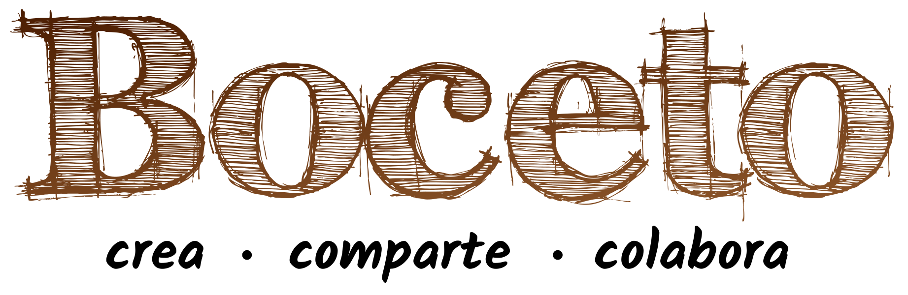
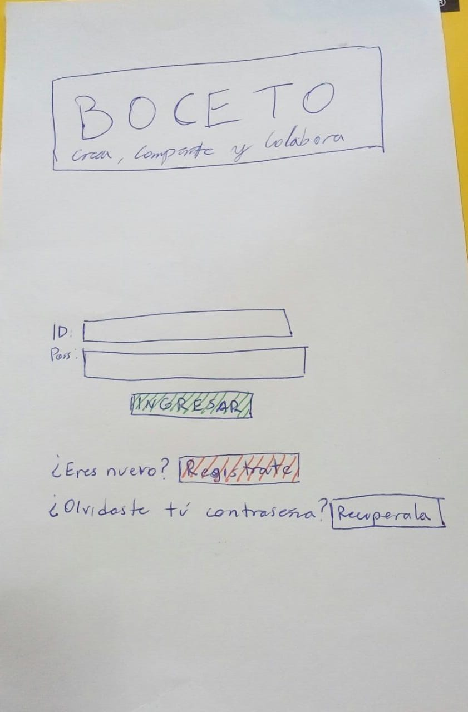

## Índice

* [1. Definición del Producto](#1-Definición-del-producto)
* [2. Objetivos](#2-¿Cuáles-son-los-objetivos-de-estos-usuarios(as)-en-relación-con-el-producto?)
* [3. Necesidades del usuario](#3-¿Cuáles-son-los-datos-más-relevantes-que-quieren-ver-en-la-interfaz-y-por-qué?)
* [4. Historias de usuario](#4-Historias-de-usuario)
* [5. Diseño de la interfaz de usuario](#5-diseño-de-la-interfaz-de-usuario)
* [6. Prototipos](#6-Prototipos)
* [7. Test de usabilidad](#7-Test-de-usabilidad)
* [8. Herramientas](#8-Herramientas-utilizadas)
* [9. Planificación](#9-planificación-del-proyecto)

***

## 1. Definición del Producto 📝

Desde hace unos años, con el mayor acceso a la tecnología, se ha dado un aumento en la práctica de la ilustración y la animación digital a nivel nacional, este auge se vio coronado con el premio oscar recibido por la productora [Punkrobot](http://punkrobot.cl/) el año 2015 por su cortometraje *La Historia de un Oso*. El galardón, trajo consigo un aumento en la oferta académica y laboral para ilustradores y animadores digitales, lo cual ha abierto espacios a más personas para aprender del área. Sin embargo, al buscar dentro del ambiente local no fue posible encontrar un espacio definido en el cual los artistas puedan hacer comunidad, donde compartir sus trabajos, colaborar con otros artistas o bien crear nuevas instancias de aprendizaje y reunión. Frente a esta necesidad nace Boceto, una red social que reune a los ilustradores y animadores digitales chilenos, permitiendoles crear redes de contacto, compartir tips sobre insumos, recibir feedback de artistas más experimentados, etc. 
A fin de entender las necesidades de nuestro usuarios, realizamos una [encuesta](https://docs.google.com/forms/d/1LuH0ZqQb1Tvlx9MY_JcZWW0Gi54LPixvdm5keL2yaYo/edit#responses) a través de Google Forms, en donde el 95% de los artistas encuestados dice que si utilizaría una red social específica para ellos y algunos comentarios sacan a relucir que actualmente no cuentan con un espacio dedicado a ellos, su trabajo y el rubro. 

## 2. ¿Cuáles son los objetivos de estos usuarios(as) en relación con el producto? 🎯

Los objetivos de los(as) usarios(as) de nuestra aplicación decidimos plasmarlos en el eslogan de Boceto: "crea, compartir y colaborar". Un espacio que fomente su creatividad, les permita compartir su trabajo y retroalimentar el trabajo de otros asi como crear instancias de colaboracion con otros artistas consiguiento promover la comunicación y generar así una red de contactos activa y nutrida. 

Boceto, responde a la necesidad de la comunidad de ilustradores(as) de compartir sus trabajos, recibir feedback, poder visualizar trabajos de otros(as) artistas(a fin de obtener inspiración y aprendizaje), información acerca de concursos/talleres/desafíos/ofertas de empleo entre otros. 

## 3. ¿Cuáles son los datos más relevantes que quieren ver en la interfaz y por qué?

A partir de la encuesta realizada, rescatamos algunos comentarios que reflejan lo que la gente espera encontrar en esta red social: 

>   "Es una muy buena iniciativa, temas como el uso de la animación en otras áreas es algo que no he visto mucho, como en ciencias por ejemplo."

> "Que el enfoque fuese profesional, no en términos de segregación, sino que aun siendo red social, no de espacio a malas intenciones (trolls, mensajes de odio y otros). Tristemente es lo que sucede cuando no hay administración adecuada de redes, y muchas veces terminan por automatizar dicha administración con bots, lo que pasa a ser un desastre" 

> "Estamos muy solos en todo sentido. No nos conocemos entre nosotros, ni el resto. Por esto no sabemos cotizar nuestro trabajo ni como vivir de él. (...)nosotros como ilustradores tampoco sabemos sacarle partido a lo que hacemos, qué vende más, por qué, que significa tener un estilo propio, en qué nivel de ilustrador/animador estoy, estoy haciendo algo único o más del montón, podría sacar mejor provecho de mi trabajo si colaboro con otros artistas, etc"

## 4. Historias de usuario

Con los datos obtenidos de la encuesta, y los comentarios que nos han dejado, creamos nuestra primera historia de usuario:

HU1: "Yo como ilustrador/animador(a) quiero publicar mi trabajo (dibujo) para recibir feedback"

HU2: "Yo como ilustrador/animador(a) quiero poder conocer de datos que otros*

## 5. Diseño de la Interfaz de Usuario 🎨

Respecto al diseño, como equipo tratamos de acercanos al ambiente que en común mantienen tanto ilustradores como animadores digitales, apelando que "toda idea  parte de un boceto", nos propusimos, crear una interfaz para rememorar la clásica libreta de dibujo (croquera) en la cual los artistas dan sus primeros trazos antes de llegar a las versiones finales  en formato digital. Este elemento del fondo se complementa con la elección de colores de gama café y anaranjado que complementa el tono claro del fondo y la gama de colores sepia del logo:

Paleta de colores: 
#FFC32F, #DEAE3E
El color naranja evoca energía, diversión y sociabilidad
El color café produce armonía, además se le conoce como el color de los artistas, por el tono de las tintas antiguas.

 Los detalles de botones, logotipo e íconos emulan el trazo "a lápiz" para dar una versión lúdica con un toque "retro" de los elementos, además de crear una identidad gráfica dentro de la interfaz reconocible para el usuario.  

Dentro de la diagramación se optó por un espacio limpio que permitiera dar protagonismo al trabajo de los usuarios y el contenido a compratir, dejando un menú de navegación básico y un espacio para el perfil del usuario que a la vez agrupe sus trabajos y los portafolios digitales externos en caso de tenerlos.

## 6. Prototipos 

[Prototipos de Baja Fidelidad] 

[Prototipo de Alta Fidelidad para app móvil](https://www.figma.com/file/pFeY0gdNy8pe4n8ntTPW7M/Boceto-app?node-id=0%3A1)

[Prototipo de Alta Fidelidad para escritorio](https://www.figma.com/file/K0EXfq6Ldq3x5qK7Q9CVLy/Boceto-web?node-id=0%3A1)

## 7. Test de usabilidad
[Test de usabilidad 1](https://www.figma.com/file/K0EXfq6Ldq3x5qK7Q9CVLy/Boceto-web?node-id=0%3A1)

[Test de usabilidad 2](https://www.loom.com/share/3e0b4170a656471c98312044b4c8b1e8)

### Iteraciones
Tras los test de usabilidad con el prototipo de alta fidelidad, detectamos que uno de los íconos puestos en el menú de navegación no era entendible por los usuarios. Así es como se realizó la primera iteración del producto, donde cambiamos el ícono por uno más intuitivo.
Con respecto a la funcionalidad, los usuarios lograron rapidamente la tarea que se les dió, que correspondía a subir una imagen al muro de la aplicación.

## 8. Herramientas Utilizadas 🛠
* JavaScript(ES6)
* HTML5
* CSS3
* Firebase
* Git Github
* Figma

## 9. Planificación del proyecto ⏱

La planificación fué realizada con  [Trello](https://trello.com/b/UNUWeMnj/red-social-fe1).
